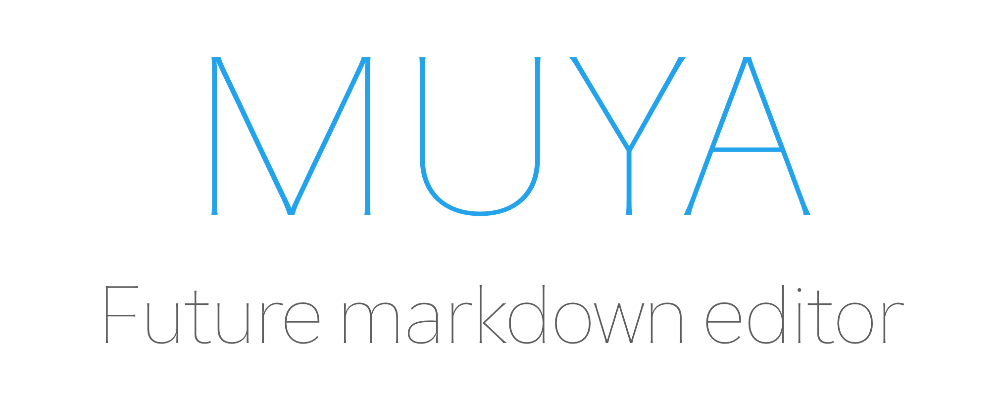

<p  align="center"></p>


**Muya** originated from [MarkText](https://github.com/marktext/marktext), which was originally used in the MarkText and provides Markdown editing support for MarkText. Today, Muya is available as a stand-alone library that provides an efficient Markdown editing experience for many web browser applications.

:a: Muya is still under development and should not be used for production.

## Installing

```sh
npm install @marktext/muya
```

## Usage

```javascript
import Muya from '@marktext/muya';
import '@marktext/muya/dist/assets/style.css';

const container = document.querySelector('#editor');
const muya = new Muya(container);
muya.init();
```

## Documents

Coming soon!!!

## Development

[commit-msg-guideline](https://github.com/angular/angular/blob/master/CONTRIBUTING.md#-commit-message-guidelines)

```sh
# step1: install dependencies
bun install
# step2: run the development codes
bun run dev
```

## Build

```sh
bun build
```

## publish

```sh
# update version numbers
npm run pub
```

## FAQ

❓ **What is the relationship between MarkText and Muya?**

Muya is derived from MarkText. Our team believes that Muya should not be limited to desktop applications. It should also run in a web browser, so we have done some compatibility with browsers and Electron applications, so that Muya can leave Electron Apps and can run into different browser environments.

❓**What is the relationship between MarkText's version and the Muya's version?**

None!

## Built with muya

- [MarkText](https://github.com/marktext/marktext) - Next generation markdown editor, running on platforms of MacOS Windows and Linux.

- [MindBox](https://www.mindbox.cc/) - A note-taking app that perfectly supports markdown syntax.

## License

MIT © [Jocs](https://github.com/Jocs)
